# Filament Instagram

[](LICENSE)

Este pacote permite exibir os posts do Instagram no seu site através da integração com o Instagram no painel Filament.

A integração com o Instagram é feita através do
pacote [justbetter/laravel-instagram-feed](https://github.com/justbetter/laravel-instagram-feed).

---

## Instalação

Você pode instalar o pacote via composer:

```bash
sail composer require agenciafmd/filament-instagram:dev-master
```

---

## Gerando as chaves

Com uma conta Facebook, vá em:

https://developers.facebook.com/apps/creation/

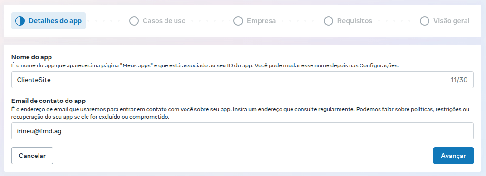

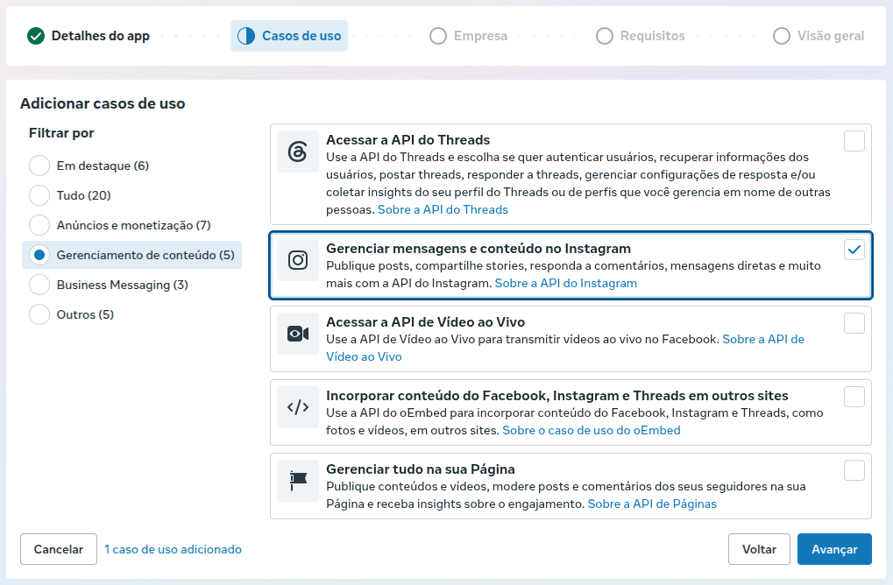

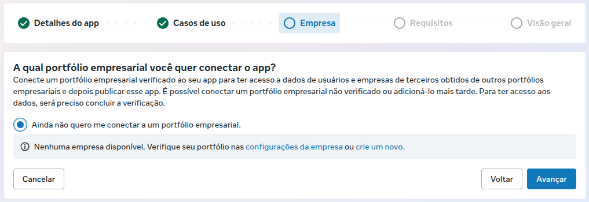

Depois do App Criado, na lateral, vá em 

Casos de uso > Gerenciar mensagens e conteúdo no Instagram > Personalizar 

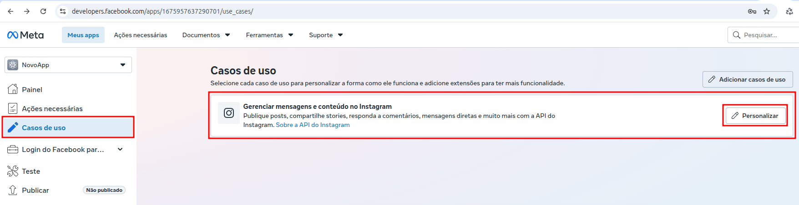

Aqui conseguimos o **Client ID** e **Client Secret**

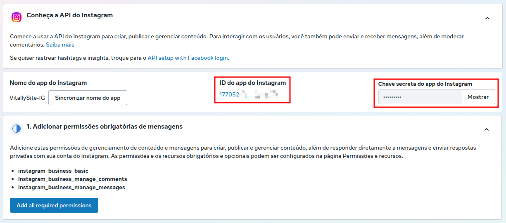

Desça até **Configurar o login da empresa no Instagram**

Clique em Configurar e adicione o callback de login.

Ela será https://{url-de-produção}/instagram/auth/callback

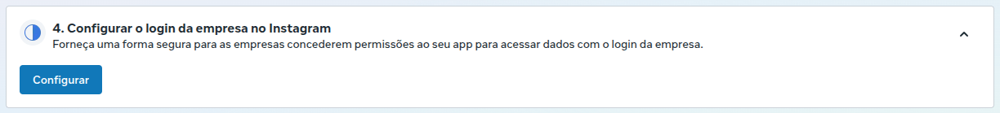

Uma vez adicionado o callback, volte no **Configurações do login da empresa** e adicione as urls dos outros ambientes.

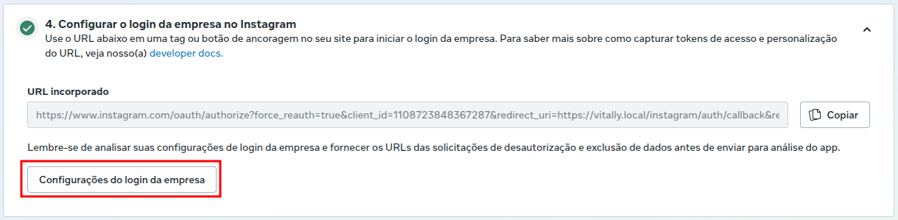

Vá agora em **Permissões e recursos** e ative as permissões:

- instagram_business_basic
- public_profile

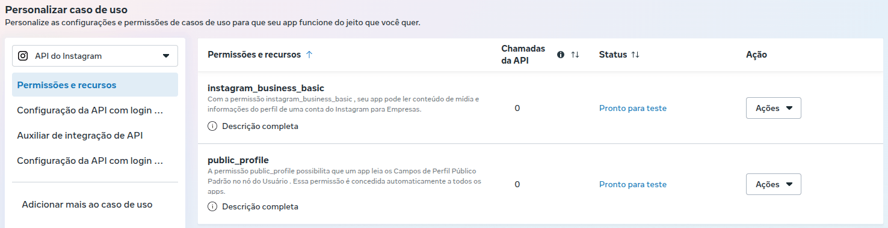

Em Configuração do app > Básico, preencha os campos obrigatórios.

> Atenção para Domínios do aplicativo, preencha com o ambiente local, homologação e produção.

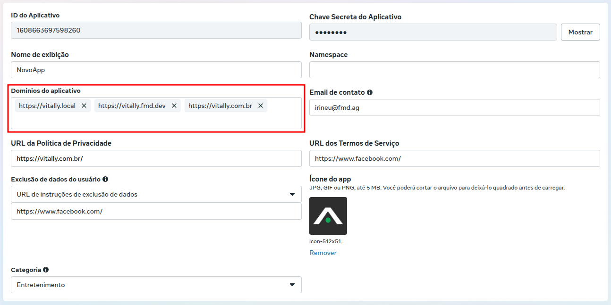

Ainda em básico, vá em **Adicionar plataforma** > Website

Adicione a url de produção.

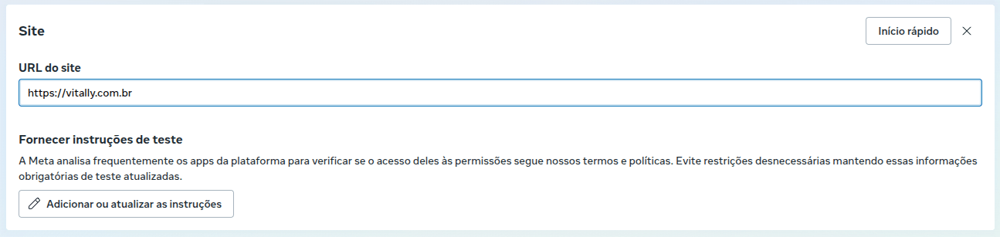

Na lateral esquerda, vá em Funções do app > Funções

Vamos em **Adicionar pessoas**

Escolhemos **Testador do Instagram** e enviamos o convite para a conta que iremos consumir.

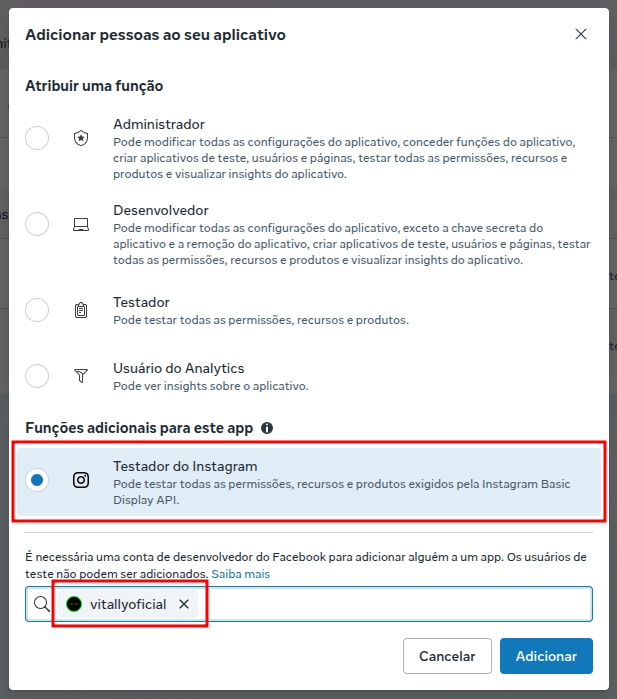

Agora no Instagram, vamos na conta que acabamos de enviar o convite.

Clicamos em Mais > Configurações (https://www.instagram.com/accounts/edit/)

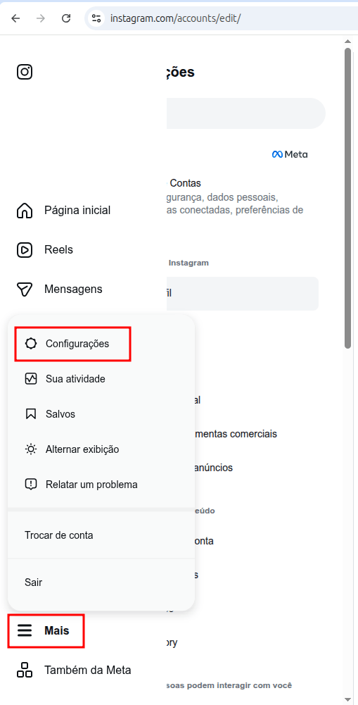

Vamos em **Seu app e suas mídias** > Permissões do site > Apps e sites

Aceite em **Convites do testador**.

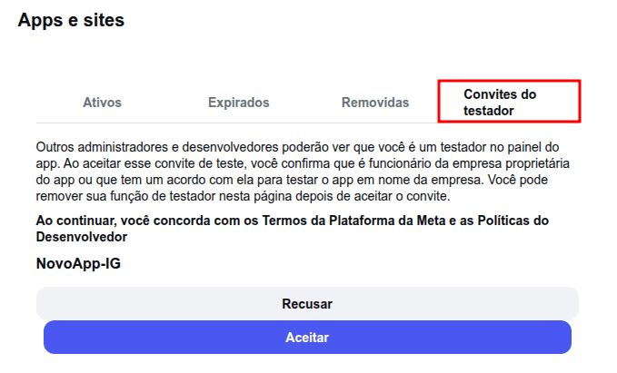

## Configuração

Adicione as variáveis de ambiente ao seu arquivo `.env`:

```env
INSTAGRAM_CLIENT_ID=
INSTAGRAM_CLIENT_SECRET=
```

Execute as migrações:

```bash
sail artisan migrate
```

Crie o perfil do Instagram:

> YourProfile é o @ do Instagram que enviamos o convite.

```bash
sail artisan instagram-feed:profile YourProfile
```

---

## Registro no Filament

Para habilitar o recurso no painel administrativo, adicione o plugin ao seu painel:

```php
use Agenciafmd\Instagram\InstagramPlugin;

return [
    'plugins' => [
        InstagramPlugin::class,
    ],
];
```